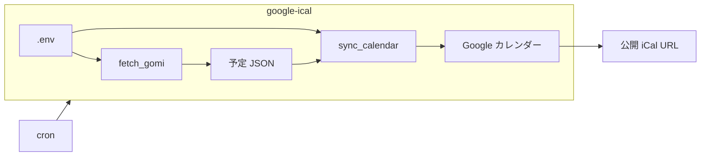

# AGENTS.md

直感的に理解できてすぐ実行できるようなコメント・ソースとする

## 概要

- cron で単発実行する Python バッチ
- **汎用 JSON** でカレンダーイベントを定義し、**Google カレンダー**へ反映する
- **ゴミ収集日**は別コマンド: `region` を ChatGPT に渡して PDF URL を調査 → PDF をダウンロード → ChatGPT で JSON 化し、予定 JSON ディレクトリへ書き出す
- **カレンダー反映**は別コマンド: 予定 JSON ディレクトリ内の **全 JSON** を読み、Google カレンダーへ反映する
- 常駐プロセス・Web フレームワークは使わない
- **リポジトリ名**: `google-ical`
- **Python パッケージ名**: `google_ical`

## 技術・構成の前提

- **言語は Python**: **Web フレームワークは使わない**。依存は必要最小限。**責務ごとにモジュール／ファイルを分ける**
- **Python 版**: **3.12**（`.python-version`）
- **実行環境**: **`.venv`** を使う
- **OS・配置・cron**: [docs/deploy.md](docs/deploy.md) で定義（頻度は本書「cron・実行頻度」）
- **タイムゾーン**: **JST（Asia/Tokyo）** を正とする
- **エントリポイント**:
  - Google 認証（初回・再認可）: `python -m google_ical.commands.auth`
  - ゴミ収集日 PDF → JSON（本番）: `python -m google_ical.commands.fetch_gomi`
  - JSON → Google カレンダー（本番）: `python -m google_ical.commands.sync_calendar`

## 設定（環境変数）

- `.env.example` をコピーして `.env` を作成する（`.env` は **Git に含めない**）
- **読み込み**: **`python-dotenv`** を利用して `.env` を読む
- **値だけ**書き換える（変数名は `.env.example` のまま）
- パス・タイムゾーン等の**ほぼ固定値**は環境変数にしない。`google_ical/config.py` を編集する

### `.env` の変数（正本: `.env.example`）

コマンドごとに読む変数が異なる。未使用の変数は未設定でもよい。

| 変数 | 必須 | 使うコマンド | 内容 |
|------|------|--------------|------|
| `GOOGLE_CLIENT_ID` | `auth` / `sync_calendar` | 同上 | Google OAuth2 クライアント ID |
| `GOOGLE_CLIENT_SECRET` | `auth` / `sync_calendar` | 同上 | 上記 OAuth クライアントのシークレット |
| `GOOGLE_ICAL_OAUTH_CONSOLE` | 任意 | `auth` | `1` 等で認可コード入力フロー。SSH 時は未設定でも自動切替することが多い |
| `GOOGLE_CALENDAR_ID` | `sync_calendar` | 同上 | 書き込み先 Google カレンダー ID（Calendar API 用。iCal 公開 URL ではない） |
| `GOMI_PDF_URL_OVERRIDE` | 任意 | `fetch_gomi` | 指定時は URL 探索をスキップし、この PDF URL から取得 |
| `GOMI_REGION` | `fetch_gomi`（`GOMI_PDF_URL_OVERRIDE` 未指定時のみ） | 同上 | 自治体名 1 件（例: `東京都〇〇区`）。PDF URL 探索に渡す |
| `OPENAI_API_KEY` | `fetch_gomi` | 同上 | OpenAI API キー |
| `OPENAI_MODEL` | `fetch_gomi` | 同上 | ChatGPT モデル名（`.env.example` は `gpt-4.1-mini`） |

### `config.py` の固定値（変更時はソースを編集）

| 定数 | 内容 |
|------|------|
| `JSON_SOURCE_DIR` | JSON 変換用ソース（PDF 等）の置き場 |
| `JSON_SOURCE_GOMI` | JSON 変換用ソースのゴミ収集日 PDF 名（`gomi.pdf`） |
| `ICAL_JSONS_DIR` | iCal 取り込み用 JSON ディレクトリ（`sync_calendar` が `*.json` を読む） |
| `ICAL_JSONS_GOMI` | ゴミ収集日の出力ファイル名（`gomi.json`） |
| `GOOGLE_TOKEN_PATH` | OAuth トークン（`config/google_token.json`） |
| `GOOGLE_ICAL_ID_KEY` / `GOOGLE_ICAL_SOURCE_KEY` | Calendar API の `extendedProperties.private` キー名 |
| `TIMEZONE` / `DATETIME_FORMAT` | ical JSON のタイムゾーン・日時形式 |

## Google 認証（`auth`）

- エントリポイント: `python -m google_ical.commands.auth`
- **OAuth2（ユーザー）**。個人 Google カレンダーへの書き込みに使う
- **初回セットアップ**と**トークン失効時の再認可**だけ手動実行する（cron では回さない）
- 専用のログイン UI は作らない。`google-auth-oauthlib` により **ブラウザで Google 公式の認可画面**を開く
- トークンファイルの保存先は **`config/google_token.json`**（固定。環境変数にしない）
- `config/google_token.json` は **Git に含めない**

### 処理の流れ

| 段 | 内容 |
|----|------|
| 1. 設定読込 | `check_auth_config()` で必須 env を検証し、`app_config` へ反映 |
| 2. ブラウザ認可 | ローカル実行時はブラウザを自動で開く。ブラウザが使えない環境では認可 URL を表示し、表示されたコードをターミナルへ入力する |
| 3. トークン保存 | 取得した refresh_token 等を `config/google_token.json` に書き出す |

### 振る舞い

| 終了コード | 意味 |
|------------|------|
| `0` | 認可成功。トークンファイルを保存した |
| 非 `0` | 認可失敗または保存失敗 |

- `sync_calendar` は `config/google_token.json` が無い、または読めないとき **非 `0` で終了**し、原因が分かる日本語メッセージを出す（例: `Google トークンがありません。python -m google_ical.commands.auth を実行してください`）
- 以降の `sync_calendar` / cron 実行では、保存済みトークンを refresh して使う（毎回 `auth` は不要）
- Linux サーバーへ初回配置するときは、手元で `auth` してできたトークンファイルをサーバーへコピーしてもよい（[docs/deploy.md](docs/deploy.md) に手順を書く）

## JSON 仕様

- 正本は本節の表と JSON 例とする
- **予定 JSON**（`EVENTS_JSON_DIR` 内）と **ゴミ収集日設定 JSON**（`GOMI_CONFIG_PATH`）で役割を分ける
- 日時は常に **JST**。JSON に `timezone` は書かない

### 予定 JSON（`EVENTS_JSON_DIR` 内の各ファイル）

- `sync_calendar` はディレクトリ内の `*.json` を **ファイル名の辞書順** で読み、すべての `events[]` を合成する
- 1 ファイル = 1 予定のまとまり（手動定義・ゴミ収集日由来・将来の自動生成など）

#### トップレベル

| キー | 必須 | 内容 |
|------|------|------|
| `source` | 任意 | 由来識別子（例: `manual`、`gomi`）。省略時 `manual`。Google 側の `google_ical_source` に引き渡す |
| `events` | 必須 | イベント配列 |

### `events[]`

| キー | 必須 | 内容 |
|------|------|------|
| `summary` | 必須 | イベントタイトル |
| `start` | 必須 | 開始日時（`YYYY-MM-DDTHH:MM:SS`、JST） |
| `end` | 必須 | 終了日時（同上） |
| `description` | 任意 | 説明文。Google カレンダーのイベント説明へ反映する |
| `all_day` | 任意 | 終日なら `true`。省略時は時刻指定（`false` 相当） |

### 内部 ID（自動生成）

- JSON に `id` は **書かない**（ユーザーが指定しない）
- 読込時に `source`・元 JSON ファイル名・`summary`・`start`・`end` から **決定的**に内部 ID を生成する
- 生成式: 上記 5 項目を改行区切りで連結した文字列の **SHA-256**（hex 64 文字）
- 同一内容なら常に同一 ID（冪等な作成・更新・削除に使う）
- Google 側には `extendedProperties.private` の `google_ical_id` として保存する
- **繰り返し（RRULE）は非対応**。同種の予定は **日付ごとに `events[]` を並べる**（その月分を個別イベントで表現する）

### ゴミ収集日設定 JSON（`GOMI_CONFIG_PATH`）

- `fetch_gomi` のみが読む（`sync_calendar` は読まない）

#### `gomi`（ゴミ収集日パイプライン）

| キー | 必須 | 内容 |
|------|------|------|
| `region` | 必須 | 自治体名 **1 件**（例: `東京都〇〇区`）。ChatGPT による PDF URL 探索に渡す |
| `output_file` | 任意 | `EVENTS_JSON_DIR` 内の出力ファイル名（デフォルト: `gomi.json`） |
| `pdf_url_override` | 任意 | 指定時は URL 探索をスキップし、この URL から PDF を取得する |

### マージ規則（`sync_calendar`）

- 合成対象は `EVENTS_JSON_DIR` 内の **全 `*.json`** の `events[]` の和集合とする
- 合成後に Google カレンダーへ一括反映する（段階的な部分更新は行わない）
- ゴミ収集日由来の予定 JSON は `fetch_gomi` が `output_file` に書き出す

### JSON テンプレート

- **2026 年 6 月**の 1 ヶ月分の雛形
- 配置先: `config/gomi_config.json`、`config/events/manual.json`、`config/events/gomi.json`

## ゴミ収集日パイプライン（`fetch_gomi`）

- エントリポイント: `python -m google_ical.commands.fetch_gomi`
- 各段が成功したあとだけ次の段へ進む
- 成功時、`EVENTS_JSON_DIR` / `gomi.output_file` に予定 JSON を書き出す。失敗時は既存ファイルを上書きしない

### 処理段

| 段 | 担当 | 内容 | 失敗時 |
|----|------|------|--------|
| 1. URL 調査 | **ChatGPT** | `gomi.region` を渡し、ゴミ収集日 PDF の URL を調査する。返却は **URL 文字列のみ** を想定する。`pdf_url_override` があればスキップする | 非 `0`。以降の段は実行しない |
| 2. PDF 取得 | プログラム | 得た URL から HTTP で PDF をダウンロードする | 非 `0`。以降の段は実行しない |
| 3. PDF→JSON | **ChatGPT** | ダウンロードした PDF を渡し、予定 JSON（`events[]`）に変換する | 非 `0`。以降の段は実行しない |
| 4. 書き出し | プログラム | `source: gomi` を付与し、`EVENTS_JSON_DIR` / `output_file` に保存する | — |

- 段 1・3 が **AI の仕事**。段 2・4 はプログラム側

### ChatGPT の仕事

- モデル: `gpt-4.1-mini`（`OPENAI_MODEL` で上書き可）
- リトライ: **しない**（失敗時は非 `0` で終了）
- URL 調査: OpenAI Responses API + `web_search`。返却は URL 文字列のみ。
- PDF→JSON: OpenAI Responses API + `input_file`（`gpt-4.1-mini`）。出力は `gomi.json` 形式の `events[]`。

#### 1. ゴミ収集日 PDF URL の調査

| 項目 | 内容 |
|------|------|
| 入力 | `gomi.region`（自治体名など） |
| 出力 | ゴミ収集日 PDF の **URL のみ**（1 文字列。JSON オブジェクトではない） |
| 意図 | 自治体の公式ゴミ収集日 PDF へのリンクを特定する |
| 幻覚対策 | プロンプトで公式ドメインを優先する。URL は段 2 で HTTP 応答を検証する |
| プロンプト | 自治体公式ドメインを最優先し、PDF ファイル URL を 1 つ返す。返答は URL 文字列のみ（説明・Markdown・引用・JSON・余分な空白は出力しない）。正本: `google_ical/content/openai_client.py` の `PDF_URL_PROMPT` |
| 応答検証 | プログラム側で URL 1 文字列・`http`/`https` を検証する。パスが `.pdf` 終端、または CMS のダウンロード URL（`/download` 等）のみ受理し、ランディングページ URL は段 1 で拒否する。PDF 本体かどうかは段 2 で Content-Type を検証する |

#### 2. PDF の JSON 変換

| 項目 | 内容 |
|------|------|
| 入力 | 段 2 でダウンロードした PDF |
| 出力 | `config/events/gomi.json` テンプレートと同じ `events[]` 形式 |
| 意図 | PDF からその月のゴミ収集日を読み取り、日付ごとのイベントにする |
| PDF 処理 | 一般的な自治体 PDF を想定。サイズ上限・事前テキスト化の特別扱いはしない |
| プロンプト | 添付 PDF からゴミ収集日を読み取り、`events[]` 相当の JSON 配列のみ返す。`all_day: true`、`end` は翌日 0:00、読み取れない予定は作らない。正本: `google_ical/content/openai_client.py` の `PDF_TO_EVENTS_PROMPT` |

- **中間スキーマは設けない**。ChatGPT の返却をそのまま予定 JSON に近い形で受け取る
- `summary` は **単純な文字列**（例: `可燃ごみ`、`不燃ごみ`）。種別の固定一覧は設けない
- 1 収集日 = `events[]` 1 件。`all_day: true` と日時はテンプレートどおり

## Google カレンダー連携（`sync_calendar`）

- エントリポイント: `python -m google_ical.commands.sync_calendar`
- **出力先**: [Google Calendar API](https://developers.google.com/calendar/api/guides/overview)
- 認証は [`auth`](#google-認証auth) で行う。`sync_calendar` は `config/google_token.json` のトークンを使う

### 同期方針

- `EVENTS_JSON_DIR` 内の全 `*.json` を読み、各ファイルの `events[]` を合成して反映する
- 成功時、**当月分を JSON どおりの状態に揃える**（作成・更新・削除）
- [内部 ID（自動生成）](#内部-id自動生成) を Google イベントの `extendedProperties.private` に `google_ical_id` として保存する
- 各イベントの `google_ical_source` は、元 JSON ファイルの `source` を引き継ぐ
- **削除対象**: 本リポが管理するイベントのうち、今回の合成結果に含まれないもの
  - 予定 JSON から消えたイベント（同一内部 ID が合成結果に無い）
  - 合成結果に無い自動生成由来イベント（例: `google_ical_source: gomi`）
- `gomi.json` が無い、または `fetch_gomi` を実行しなかった月は、ゴミ収集日由来イベントは合成結果に含まれない。次回 `sync_calendar` 成功時に既存の該当イベントは削除される
- 本リポが付与していない `extendedProperties` のイベントは触らない

### イベントの日時

- `start` / `end` は常に **`YYYY-MM-DDTHH:MM:SS`（JST）** とする（終日も同形式）
- `all_day: true` のときは Google Calendar API へ終日イベントとして変換する
- 終日 1 日分の例: `"start": "2026-06-15T00:00:00"`, `"end": "2026-06-16T00:00:00"`（`end` は翌日 0:00）
- ゴミ収集日は **終日のみ**（`all_day: true`）
- **複数日にまたがるイベントは非対応**（1 イベント = 1 日分）
- **繰り返し（RRULE）も非対応**。必要ならその月の全日分を `events[]` に並べる

## 振る舞い（必ず守る）

- 本番は **`fetch_gomi` → `sync_calendar`** の順で実行する（同一 cron 内で連続実行する想定）
- 各コマンド内では **前段が成功したあと**だけ次へ進む
- 同じ入力なら同じ JSON・同じイベント集合になるよう **出力は決定的** に寄せる
- カレンダーの手動編集は Google カレンダー側で行う。本バッチは JSON とゴミ収集日 PDF を正本とする
- 常駐プロセスや GUI は前提にしない（**cron 等の単発実行**）

### `fetch_gomi` のパイプライン

- **設定読込 →（ChatGPT）URL 調査 → PDF 取得 →（ChatGPT）PDF→JSON → 予定 JSON 書き出し**

### `sync_calendar` のパイプライン

- **設定読込 → 予定 JSON ディレクトリ読込 → イベント合成 → Google 反映**

### 成功または失敗時の挙動

| 終了コード | 意味 |
|------------|------|
| `0` | 当該コマンドの全段成功 |
| 非 `0` | 当該コマンドのいずれかの段階で失敗（cron の失敗検知用） |

- `fetch_gomi` が失敗したら **出力予定ファイルは上書きしない**（直前の内容を維持）
- `sync_calendar` が失敗したら **Google カレンダーは一切更新しない**（直前の状態を維持）
- `fetch_gomi` 失敗後も `sync_calendar` を実行するかは [docs/deploy.md](docs/deploy.md) の判断とする（推奨: 失敗時は `sync_calendar` をスキップする）
- 非 `0` のとき、原因が追える事実を残す（例: `PDF 取得失敗 url=… status=…`、`ChatGPT 応答解析失敗`）
- cron 時の stdout / stderr の保存先は [docs/deploy.md](docs/deploy.md) に書く

## cron・実行頻度

- 単発バッチとする
- **頻度**: **月 1 回**（ゴミ収集日 PDF の取得・カレンダー更新が目的）
- **実行順**: `fetch_gomi` → `sync_calendar`（同一 cron 内で連続）
- **実行時刻**: [docs/deploy.md](docs/deploy.md) で定義する（本書では具体時刻を書かない）

## 単体テスト（最小仕様）

- テストランナーは `pytest` を使う
- 単体テストは責務単位で分ける（**予定 JSON ディレクトリ読込**、**イベント合成**、**ゴミ収集日 PDF→予定 JSON の正規化**）
- 設定読込は必須環境変数不足で失敗し、原因が分かる日本語メッセージを返す
- テストファイルは実行ファイル単位で分ける
- テスト関数は対象関数ごとに分ける（1 テスト関数 = 1 関数の 1 観点）
- ゴミ収集日正規化は同一入力で同一イベント集合になることを保証する
- **Google Calendar API・ChatGPT API・実 PDF 取得は単体テスト対象外** とし、必要な確認は結合テストで行う

## エージェント向け

### 正本との分担

| 正本 | 内容 |
|------|------|
| 本書（AGENTS.md） | 要件・振る舞い・テスト観点 |
| `google_ical/` の **docstring・コメント** | 骨組みの意味・用語・例（`commands` / `content` の役割など） |

- 骨組みの説明を直すときは **ソースだけ**直す（本書に同じ説明は書かない）

### パッケージ `google_ical`

| ファイル | 見る場所（説明の正本） |
|----------|------------------------|
| `commands/auth/main.py` | Google OAuth 認可（`python -m google_ical.commands.auth`） |
| `commands/fetch_gomi/main.py` | ゴミ収集日パイプライン本体（`python -m google_ical.commands.fetch_gomi`） |
| `commands/sync_calendar/main.py` | 予定 JSON → Google 反映（`python -m google_ical.commands.sync_calendar`） |
| `cli.py` | コマンド共通の終了コード処理 |
| `config.py` | コマンド別 `check_*_config`、固定値定数、`app_config` |
| `exceptions.py` | 共通例外（`GoogleIcalError` 基底） |
| `pipeline_log.py` | 段階ログ（stdout / stderr） |
| `content/events/models.py` | 予定 JSON のドメイン型・内部 ID 生成 |
| `content/events/schemas.py` | 予定 JSON の Pydantic 検証 |
| `content/events/loader.py` | 予定 JSON ディレクトリ読込・合成 |
| `content/events/writer.py` | 予定 JSON ファイル書き出し |
| `content/gomi/config.py` | ゴミ収集日設定 JSON 読込 |
| `content/gomi/normalize.py` | ChatGPT 返却 events[] のゴミ収集日正規化 |
| `content/gomi/pipeline.py` | `fetch_gomi` 各段処理 |
| `content/pdf.py` | PDF HTTP 取得 |
| `content/openai_client.py` | ChatGPT（URL 調査・PDF→JSON） |
| `content/google/auth.py` | OAuth トークン読込・保存 |
| `content/google/calendar.py` | Calendar API 薄いアダプタ |
| `content/google/sync.py` | Google Calendar API 同期 |

### コメントの書き方

- **日本語**。ぱっと見で意図が分かる短さ（例・典型呼び出し・段名の役割）
- **仕様の羅列は書かない**（終了コード・環境変数などは本書 / [docs/deploy.md](docs/deploy.md)）
- 実装指示がない限り、**コードや依存を勝手に増やさない**
- **fetch_gomi → sync_calendar** の段の順を崩さない
- 依存追加・運用（cron 等）の変更は、**影響を短く説明**する
- 要件が曖昧、または意図と食い違う・違和感があるときは、**質問してから**進める
- レート制限・パラメータ名・エラーコードは **公式ドキュメントを正**とする
- タイムゾーンは **日本標準時（JST）**
