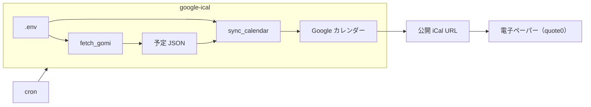

# ゴミ収集日収集ツール


## 目的

JSON とゴミ収集日 PDF から Google カレンダーを更新するバッチ。


## 概要

1. ChatGPT による **ゴミ収集日 PDF** の URL 調査
2. URL から **ゴミ収集日 PDF** をダウンロード
3. ChatGPT により **ゴミ収集日 PDF** を **予定 JSON** に変換
4. **予定 JSON** を保存
5. 全 **予定 JSON** を Google カレンダーへ反映



*カレンダーに登録したゴミ収集日を [電子ペーパー（quote0）](https://github.com/ryofujimotox/quote0) に表示すると便利。*


## 最低限の動作確認手順

- 詳細な手順は [docs/deploy.md](./docs/deploy.md) を参照
- Python **3.12** （[.python-version](./.python-version)）


### 1. 環境構築

```bash
git clone https://github.com/ryofujimotox/google-ical && cd google-ical
python -m pip install -r requirements.txt
cp -n .env.example .env
```

- `.env` を編集する。[AGENTS.md](./AGENTS.md) どおり。


### 2. Google 認証（初回のみ）

```bash
python -m google_ical.commands.auth
```


### 3. 手動実行

```bash
python -m google_ical.commands.fetch_gomi
python -m google_ical.commands.sync_calendar
```


## 技術スタック

- Python 3.12（[.python-version](./.python-version)）
- 予定 JSON（手動定義・ゴミ収集日由来）
- Google Calendar API（書き込み）
- OpenAI API（ゴミ収集日 PDF 調査・JSON 化）
- pytest（単体テスト）


## 設計の要点

- **fetch_gomi → sync_calendar** の順で実行（月 1 回 cron）
- 予定は **JSON ディレクトリ内の全 `*.json`** を合成して反映
- 内部 ID は **SHA-256** で冪等に作成・更新・削除


## フォルダ構成

```
AGENTS.md                  # 要件・振る舞い（仕様の正本）

docs/
  deploy.md                # Linux 配置・cron
  git.md                   # Git 運用
  issue-parallel-plan.md   # Issue 並行解決プラン（テンプレート）

google_ical/
  config.py                # 必須環境変数 → AppConfig
  constants.py             # 固定パス・デフォルト値
  exceptions.py            # 共通例外
  cli.py                   # コマンド共通の終了処理
  pipeline_log.py          # 段階ログ
  commands/                # 実行可能コマンド（auth / fetch_gomi / sync_calendar）
  content/
    events/                # 予定 JSON（models / schemas / loader / writer）
    gomi/                  # ゴミ収集日（config / normalize / pipeline）
    openai_client.py       # ChatGPT（URL 調査・PDF→JSON）
    google_auth.py         # OAuth トークン
    google_sync.py         # Google カレンダー同期
    pdf.py                 # PDF HTTP 取得

config/
  gomi_config.json         # ゴミ収集日設定
  events/                  # 予定 JSON テンプレート

tests/                     # 単体テスト（google_ical/ と同じ階層）
  content/

.env.example               # 環境変数名テンプレ

LICENSE                    # 本体（MIT）
```
