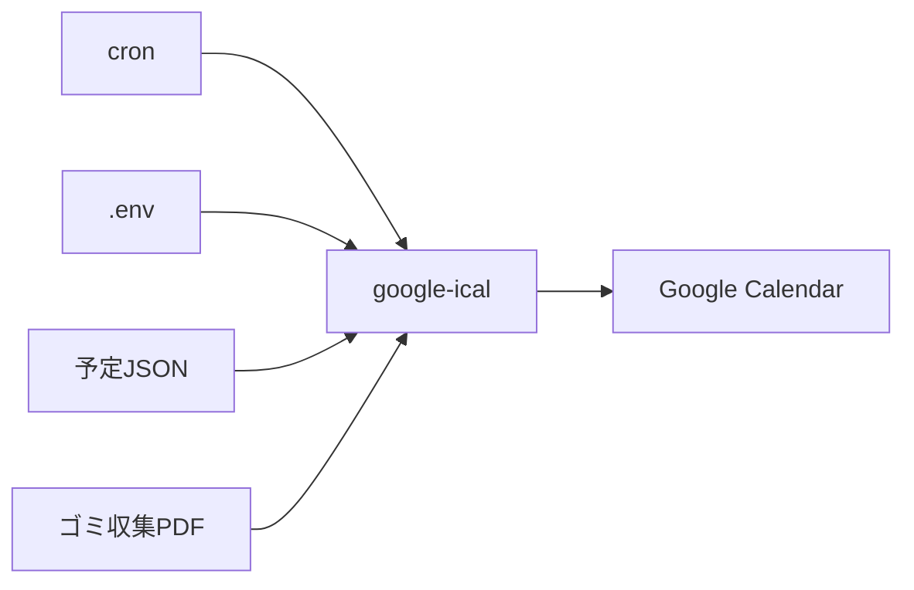

# google-ical

JSON とゴミ収集日 PDF から Google カレンダーを更新する cron 向けバッチです。

## 目的

- 家族や生活用の固定予定を JSON で管理する
- 自治体が公開するゴミ収集日 PDF から収集予定を取り込む
- 生成した予定を Google Calendar API で作成・更新・削除する

## 概要



同期時は Google Calendar の `extendedProperties.private` に同期 ID を保存し、このバッチが作成した予定だけを管理します。手入力した予定は変更しません。

## 最低限の動作確認

```bash
git clone https://github.com/ryofujimotox/google-ical
cd google-ical
python3.12 -m venv .venv
.venv/bin/pip install -r requirements.txt
cp -n .env.example .env
```

`.env` を編集したあと、次を実行します。

```bash
.venv/bin/python -m google_ical
.venv/bin/python -m google_ical.commands.sync_calendar --dry-run
.venv/bin/python -m google_ical.commands.sync_calendar
```

## コマンド

| コマンド | 内容 |
|----------|------|
| `python -m google_ical` | `.env` 読み込み確認 |
| `python -m google_ical.commands.fetch_gomi` | ゴミ収集PDFを予定JSONとして標準出力 |
| `python -m google_ical.commands.sync_calendar` | JSON/PDFからGoogle Calendarを同期 |

## 技術スタック

- Python 3.12
- Google Calendar API
- pypdf（PDFテキスト抽出）
- pytest（単体テスト）

## フォルダ構成

```text
google_ical/
  config.py                  # .env → AppConfig
  main.py                    # 設定確認
  commands/
    fetch_gomi/              # ゴミPDF解析コマンド
    sync_calendar/           # Google Calendar同期コマンド
  content/
    events/                  # 共通イベントモデルとGoogleリソース変換
    gomi/                    # ゴミPDF取得・解析
  google/                    # Google APIアダプタ
docs/
  deploy.md                  # Linux配置・cron
  events-json.md             # 固定予定JSON形式
  git.md                     # ブランチ・コミット運用
tests/                       # 単体テスト
```

## 詳細

- 実装要件と振る舞い: [AGENTS.md](AGENTS.md)
- デプロイ手順: [docs/deploy.md](docs/deploy.md)
- JSON 形式: [docs/events-json.md](docs/events-json.md)
- Git 運用: [docs/git.md](docs/git.md)
